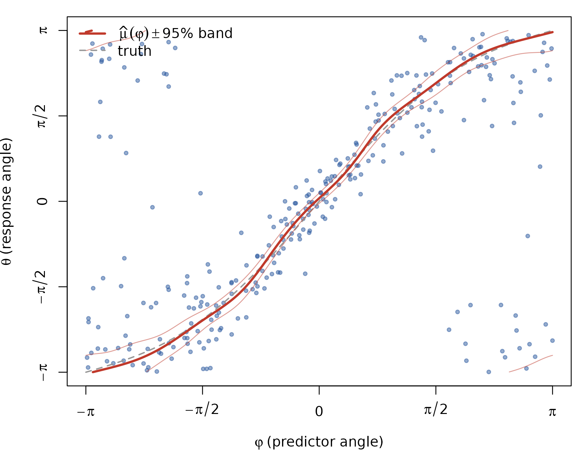
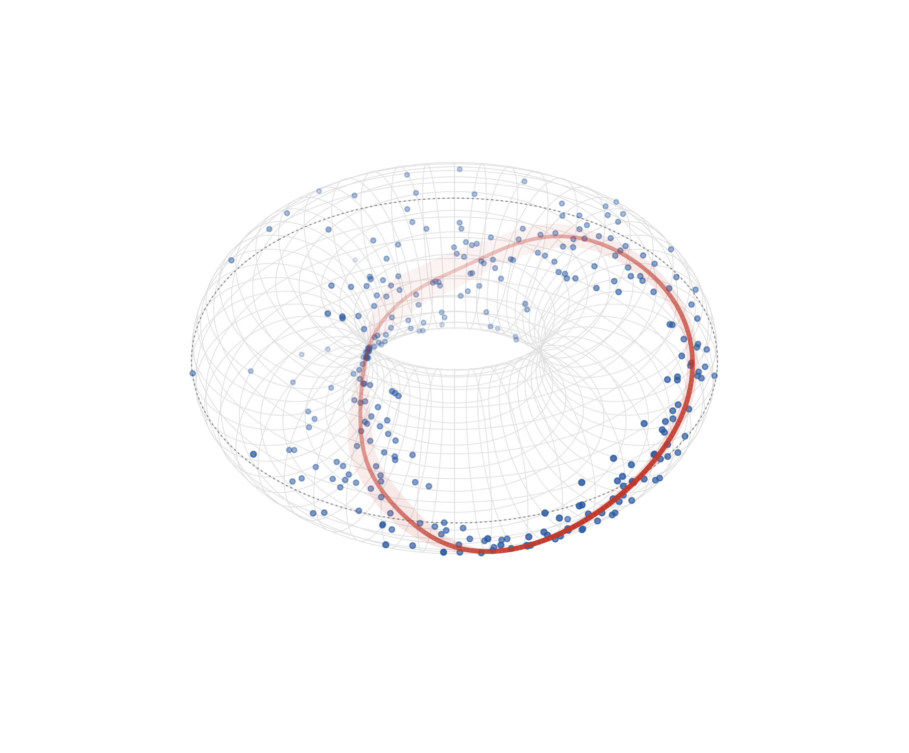
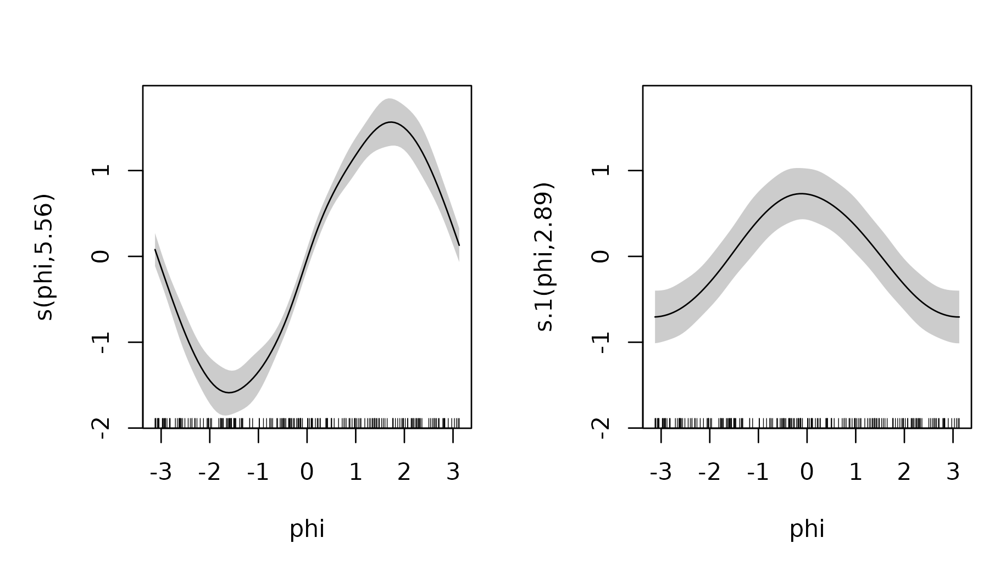
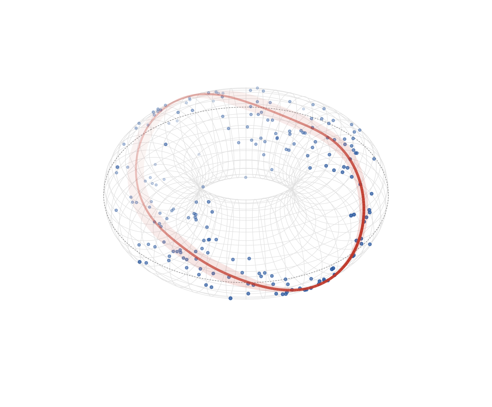

# Circular–circular regression on the torus

*One of three response–predictor geometries:
[C–L](https://huangziwei.github.io/circlss/articles/circular-linear-regression.md)
·
[L–C](https://huangziwei.github.io/circlss/articles/linear-circular-regression.md)
· **C–C**.*

A circular–circular (C–C) regression has an angle on both sides: the
response $`\theta`$ and the predictor $`\varphi`$ each live on the
circle. In `circlss` the predictor side is mgcv-native — the covariate
enters through a *cyclic* spline basis (`bs = "cc"`), so fitted curves
close seamlessly at $`\pm\pi`$ — and the response side is a family
choice with a real consequence:

- **[`pnlss()`](https://huangziwei.github.io/circlss/reference/pnlss.md)
  is the general default for C–C.** The response is the angle of a
  bivariate normal with mean $`(\mu_1(\varphi),
  \mu_2(\varphi))`$, both identity-linked, so the fitted mean direction
  $`\mathrm{atan2}(\hat\mu_2, \hat\mu_1)`$ has no branch cut and can
  **wind** around the circle — including the most classical C–C pattern,
  rotation-type association ($`\theta \approx \varphi`$: wind direction
  at $`t`$ vs $`t+\Delta`$, paired before/after headings).
- **[`vmlss()`](https://huangziwei.github.io/circlss/reference/vmlss.md)
  is the interpretable special case.** Mean direction and concentration
  are separate parameters with their own smooths — but its tan-half mean
  map $`\mu = 2\arctan\{\eta(\varphi)\}`$ has winding number zero and
  cannot cross $`\theta = \pm\pi`$, so it only suits relationships that
  *oscillate around a reference direction* rather than wind.

The natural picture for either is a **torus**: predictor angle around
the ring, response angle around the tube, and the fitted mean direction
a closed curve on the surface.

## A winding relationship, with `pnlss`

Simulating the canonical C–C pattern — the response direction tracks the
predictor around the circle (winding number 1), with some modulation and
a concentration that varies over the cycle. Projected normal draws need
no rejection sampler: the response is literally the angle of a noisy 2-D
vector.

``` r

library(mgcv)
#> Loading required package: nlme
#> This is mgcv 1.9-4. For overview type '?mgcv'.
library(circlss)

set.seed(20260612)
n <- 300
phi <- runif(n, -pi, pi)
dir_true <- phi + 0.6 * sin(phi)            # winds once per cycle
gamma_true <- exp(0.6 + 0.5 * cos(phi))     # concentration scale
theta <- atan2(gamma_true * sin(dir_true) + rnorm(n),
               gamma_true * cos(dir_true) + rnorm(n))
dat <- data.frame(theta = theta, phi = phi)
```

Both Cartesian mean components get their own cyclic smooth; the knots
pin the period to $`(-\pi, \pi]`$:

``` r

b <- gam(list(theta ~ s(phi, bs = "cc", k = 10),
                    ~ s(phi, bs = "cc", k = 10)),
         family = pnlss(), data = dat, method = "REML",
         knots = list(phi = c(-pi, pi)))
summary(b)
#> 
#> Family: pnlss 
#> Link function: identity identity 
#> 
#> Formula:
#> theta ~ s(phi, bs = "cc", k = 10)
#> ~s(phi, bs = "cc", k = 10)
#> 
#> Parametric coefficients:
#>               Estimate Std. Error z value Pr(>|z|)
#> (Intercept)    0.05426    0.08386   0.647    0.518
#> (Intercept).1  0.01323    0.07683   0.172    0.863
#> 
#> Approximate significance of smooth terms:
#>            edf Ref.df Chi.sq p-value    
#> s(phi)   6.827      8  281.6  <2e-16 ***
#> s.1(phi) 6.356      8  249.8  <2e-16 ***
#> ---
#> Signif. codes:  0 '***' 0.001 '**' 0.01 '*' 0.05 '.' 0.1 ' ' 1
#> 
#> Deviance explained = 61.6%
#> -REML = 289.83  Scale est. = 1         n = 300
```

The fitted direction and its 95% band. The direction depends on *both*
linear predictors, so the band is a delta-method interval: the joint
coefficient covariance `Vp` pushed through $`\mathrm{atan2}(\mu_2,
\mu_1)`$ via the `lpmatrix` — two lines of algebra, and a taste of how
inference works when the parameters are entangled:

``` r

phig <- seq(-pi, pi, length.out = 400)
pr <- predict(b, newdata = data.frame(phi = phig), type = "response")
dir_hat <- atan2(pr[, 2], pr[, 1])

Xp <- predict(b, newdata = data.frame(phi = phig), type = "lpmatrix")
lpi <- attr(Xp, "lpi")
X1 <- Xp[, lpi[[1]], drop = FALSE]
X2 <- Xp[, lpi[[2]], drop = FALSE]
V <- b$Vp
v11 <- rowSums((X1 %*% V[lpi[[1]], lpi[[1]]]) * X1)
v22 <- rowSums((X2 %*% V[lpi[[2]], lpi[[2]]]) * X2)
v12 <- rowSums((X1 %*% V[lpi[[1]], lpi[[2]]]) * X2)
m1 <- pr[, 1]; m2 <- pr[, 2]; r2 <- m1^2 + m2^2
se_dir <- sqrt(pmax(m2^2 * v11 + m1^2 * v22 - 2 * m1 * m2 * v12, 0)) / r2
dir_lo <- dir_hat - 1.96 * se_dir
dir_hi <- dir_hat + 1.96 * se_dir
```

### Flat view

Both axes are circles, so the winding fit is a diagonal that wraps: the
top and bottom edges are the same line, as are left and right. Curves
are broken at the wrap to avoid spurious verticals:

``` r

lines_wrapped <- function(x, y, ...) {
  y <- atan2(sin(y), cos(y))
  br <- which(abs(diff(y)) > pi)
  s0 <- c(1, br + 1); s1 <- c(br, length(y))
  for (k in seq_along(s0))
    if (s1[k] > s0[k]) lines(x[s0[k]:s1[k]], y[s0[k]:s1[k]], ...)
}

op <- par(mar = c(4, 4, 1, 1))
plot(dat$phi, dat$theta, pch = 19, col = adjustcolor("#2c5aa0", 0.5),
     cex = 0.6, xlab = expression(varphi ~ "(predictor angle)"),
     ylab = expression(theta ~ "(response angle)"),
     xlim = c(-pi, pi), ylim = c(-pi, pi), axes = FALSE)
axis(1, at = c(-pi, -pi/2, 0, pi/2, pi),
     labels = expression(-pi, -pi/2, 0, pi/2, pi))
axis(2, at = c(-pi, -pi/2, 0, pi/2, pi),
     labels = expression(-pi, -pi/2, 0, pi/2, pi))
box()
lines_wrapped(phig, dir_true_g <- phig + 0.6 * sin(phig),
              col = "gray60", lwd = 1.6, lty = 2)
lines_wrapped(phig, dir_lo, col = adjustcolor("#c0392b", 0.5), lwd = 1)
lines_wrapped(phig, dir_hi, col = adjustcolor("#c0392b", 0.5), lwd = 1)
lines_wrapped(phig, dir_hat, col = "#c0392b", lwd = 2.6)
legend("topleft", bty = "n", lwd = c(2.6, 1.6), lty = c(1, 2),
       col = c("#c0392b", "gray60"), bg = NA,
       legend = c(expression(hat(mu)(varphi) %+-% "95% band"), "truth"))
```



``` r

par(op)
```

### The torus

$`(\varphi, \theta)`$ maps to $`\big((R + r\cos\theta)\cos\varphi,\
(R + r\cos\theta)\sin\varphi,\ r\sin\theta\big)`$. Base graphics is
enough: [`persp()`](https://rdrr.io/r/graphics/persp.html) supplies the
projection matrix, everything is drawn through
[`trans3d()`](https://rdrr.io/r/grDevices/trans3d.html), with
depth-based fading as the 3-D cue and the 95% band as a translucent
ribbon (the dashed circle is the outer equator $`\theta = 0`$):

``` r

torus_xyz <- function(phi, theta, R = 1.9, r = 0.95) {
  list(x = (R + r * cos(theta)) * cos(phi),
       y = (R + r * cos(theta)) * sin(phi),
       z = r * sin(theta))
}

# view-space depth from the persp transformation matrix (trans3d gives
# only the projected x/y; the z/w component orders front vs back)
depth3d <- function(x, y, z, pm) {
  p <- cbind(x, y, z, 1) %*% pm
  p[, 3] / p[, 4]
}

draw_torus <- function(dat, mu_hat, phig, lo = NULL, hi = NULL,
                       R = 1.9, r = 0.95, theta_view = 45, phi_view = 38) {
  op <- par(mar = c(0.2, 0.2, 0.2, 0.2))
  on.exit(par(op))
  lim <- R + r + 0.1
  pm <- persp(x = c(-lim, lim), y = c(-lim, lim),
              z = matrix(c(-r, -r, r, r), 2, 2),
              zlim = c(-r - 0.5, r + 0.5),
              theta = theta_view, phi = phi_view, d = 4,
              scale = FALSE, expand = 1,
              col = NA, border = NA, box = FALSE, axes = FALSE)

  ## wireframe: tube circles at fixed phi, ring circles at fixed theta
  thd <- seq(-pi, pi, length.out = 80)
  for (p in seq(-pi, pi, length.out = 49)[-1]) {
    w <- torus_xyz(rep(p, length(thd)), thd, R, r)
    lines(trans3d(w$x, w$y, w$z, pm), col = "gray88", lwd = 0.6)
  }
  phd <- seq(-pi, pi, length.out = 160)
  for (t in seq(-pi, pi, length.out = 25)[-1]) {
    w <- torus_xyz(phd, rep(t, length(phd)), R, r)
    lines(trans3d(w$x, w$y, w$z, pm), col = "gray88", lwd = 0.6)
  }

  ## outer equator (theta = 0): the zero-response reference line
  w <- torus_xyz(phd, rep(0, length(phd)), R, r)
  lines(trans3d(w$x, w$y, w$z, pm), col = "gray55", lty = 3, lwd = 0.9)

  ## data on the torus surface, depth-faded (near = opaque, far = faint)
  w <- torus_xyz(dat$phi, dat$theta, R, r)
  dp <- depth3d(w$x, w$y, w$z, pm)
  a <- 0.15 + 0.7 * (dp - min(dp)) / diff(range(dp))
  pt <- trans3d(w$x, w$y, w$z, pm)
  ord <- order(dp)  # paint far points first
  points(pt$x[ord], pt$y[ord], pch = 19,
         cex = 0.4 + 0.25 * a[ord],
         col = sapply(a[ord], function(ai) adjustcolor("#2c5aa0", ai)))

  ## 95% ribbon between lo(phi) and hi(phi): translucent quads painted in
  ## depth order, subdivided across the band so it follows the tube
  if (!is.null(lo) && !is.null(hi)) {
    K <- 4
    i0 <- seq_len(length(phig) - 1)
    quads <- list()
    for (k in seq_len(K)) {
      t0 <- lo + (hi - lo) * (k - 1) / K
      t1 <- lo + (hi - lo) * k / K
      for (i in i0) {
        th <- c(t0[i], t0[i + 1], t1[i + 1], t1[i])
        ph <- c(phig[i], phig[i + 1], phig[i + 1], phig[i])
        w <- torus_xyz(ph, th, R, r)
        quads[[length(quads) + 1]] <-
          list(p = trans3d(w$x, w$y, w$z, pm),
               d = mean(depth3d(w$x, w$y, w$z, pm)))
      }
    }
    dq <- vapply(quads, `[[`, numeric(1), "d")
    aq <- 0.05 + 0.13 * (dq - min(dq)) / diff(range(dq))
    for (j in order(dq)) {
      polygon(quads[[j]]$p$x, quads[[j]]$p$y, border = NA,
              col = adjustcolor("#c0392b", aq[j]))
    }
  }

  ## fitted mean-direction curve, painted in depth order, far half faint
  w <- torus_xyz(phig, mu_hat, R, r)
  dp <- depth3d(w$x, w$y, w$z, pm)
  cv <- trans3d(w$x, w$y, w$z, pm)
  a <- 0.25 + 0.75 * (dp - min(dp)) / diff(range(dp))
  seg <- data.frame(x0 = head(cv$x, -1), y0 = head(cv$y, -1),
                    x1 = tail(cv$x, -1), y1 = tail(cv$y, -1),
                    d = head(dp, -1), a = head(a, -1))
  seg <- seg[order(seg$d), ]
  segments(seg$x0, seg$y0, seg$x1, seg$y1,
           col = sapply(seg$a, function(ai) adjustcolor("#c0392b", ai)),
           lwd = 2.2 + 1.6 * seg$a, lend = 1)
  invisible(pm)
}
```

``` r

draw_torus(dat, dir_hat, phig, lo = dir_lo, hi = dir_hi)
```



The fitted mean direction winds once around the tube while going once
around the ring — a (1,1) curve on the torus, with its delta-method
ribbon hugging it. This is the shape the tan-half family cannot produce.

## The interpretable special case: `vmlss`

When the relationship *oscillates* rather than winds — the response
swinging around a reference direction as the predictor cycles (diurnal
wind rotation, heading vs season) — `vmlss` buys you something `pnlss`
does not: the mean direction $`\mu(\varphi)`$ and the concentration
$`\kappa(\varphi)`$ are separate, interpretable parameters, each with
its own smooth and credible band.

``` r

rvm <- function(n, mu, kappa) {
  mu <- rep_len(mu, n); kappa <- rep_len(kappa, n); out <- numeric(n)
  for (i in seq_len(n)) {
    k <- kappa[i]
    a <- 1 + sqrt(1 + 4 * k * k); b <- (a - sqrt(2 * a)) / (2 * k)
    r <- (1 + b * b) / (2 * b)
    repeat {
      z <- cos(pi * runif(1)); f <- (1 + r * z) / (r + z)
      cc <- k * (r - f); u2 <- runif(1)
      if (cc * (2 - cc) - u2 > 0 || log(cc / u2) + 1 - cc >= 0) {
        out[i] <- sign(runif(1) - 0.5) * acos(max(min(f, 1), -1)) + mu[i]
        break
      }
    }
  }
  atan2(sin(out), cos(out))
}

set.seed(20260612)
n <- 200
phi2 <- runif(n, -pi, pi)
theta2 <- rvm(n, 2 * atan(1.6 * sin(phi2)), exp(1.4 + 0.6 * cos(phi2)))
dat2 <- data.frame(theta = theta2, phi = phi2)

b2 <- gam(list(theta ~ s(phi, bs = "cc", k = 10),
                     ~ s(phi, bs = "cc", k = 10)),
          family = vmlss(), data = dat2, method = "REML",
          knots = list(phi = c(-pi, pi)))
```

The two estimated smooths on the link scale — $`\eta_1`$ drives the
tan-half location, $`\eta_2`$ the log concentration; this per-parameter
readout is the point of the family:

``` r

plot(b2, pages = 1, scheme = 1)
```



The mean direction’s 95% band comes from the link-scale standard errors
pushed through the monotone tan-half link (the standard endpoint
transform), and the fit goes on the same torus:

``` r

prl <- predict(b2, newdata = data.frame(phi = phig), type = "link",
               se.fit = TRUE)
mu_hat <- 2 * atan(prl$fit[, 1])
mu_lo <- 2 * atan(prl$fit[, 1] - 1.96 * prl$se.fit[, 1])
mu_hi <- 2 * atan(prl$fit[, 1] + 1.96 * prl$se.fit[, 1])
draw_torus(dat2, mu_hat, phig, lo = mu_lo, hi = mu_hi)
```



An oscillation: the curve rises over the tube where the response leads,
dips where it lags, and crosses the dashed zero-equator twice — winding
number zero, exactly the class `vmlss` can represent. The scope rule in
one breath: the tan-half map keeps $`\mu`$ inside $`(-\pi, \pi)`$ — it
can neither cross the antipode of the response origin nor wind, so for
rotation-type data reach for `pnlss` (or model the wrapped residual
$`\theta - m\varphi`$ with known winding $`m`$ and add $`m\varphi`$
back).

## Same models, same numbers, in Python

Both families are mgcv twins of
[pycircstat2](https://github.com/circstat/pycircstat2)’s
`CLRegression(..., family=pnlss | vmlss)`, differentially tested against
it on every release — identical data, Newton-REML both sides. The
cyclic-spline cases, including the winding projected-normal one, agree
to near machine precision (see `tests/testthat/test-*-parity.R` and
`dev/parity/` in the repository).
