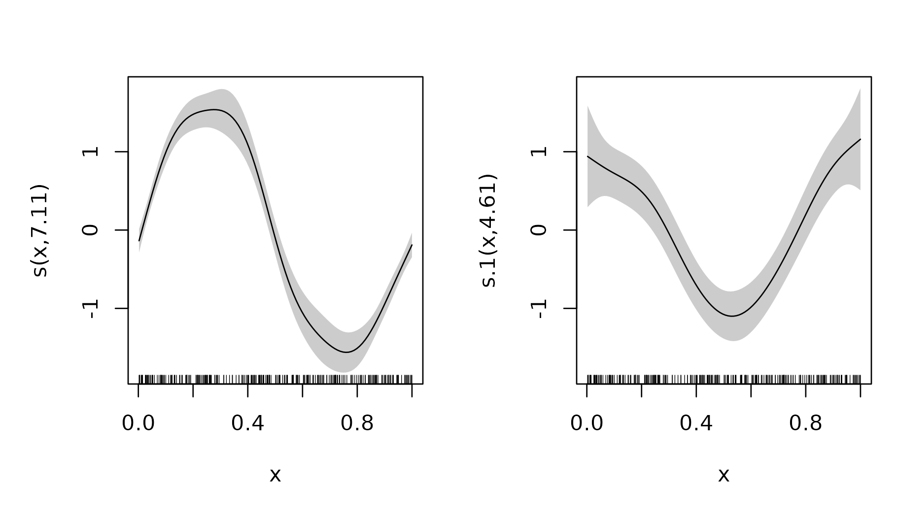
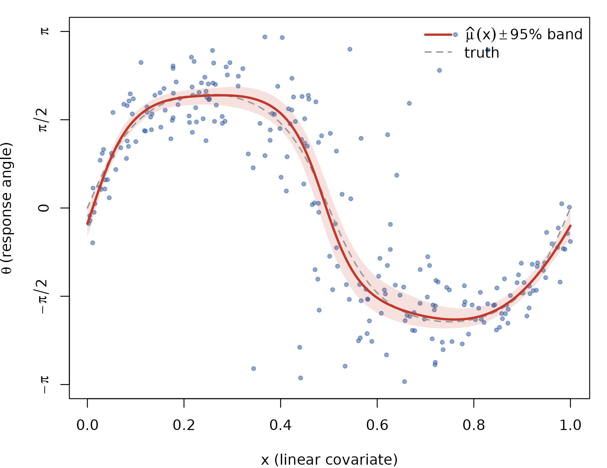
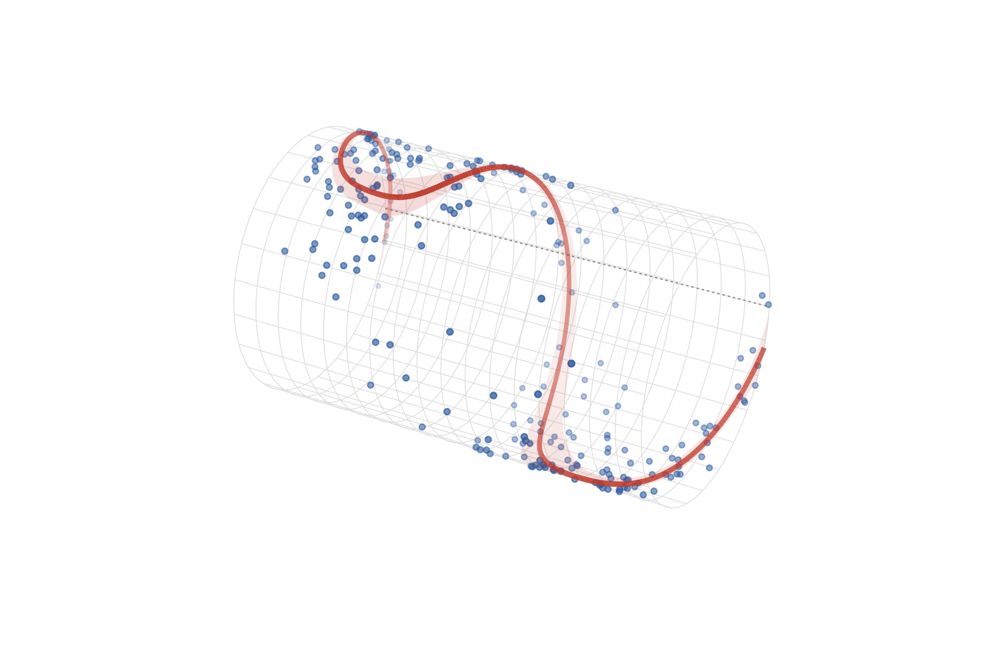
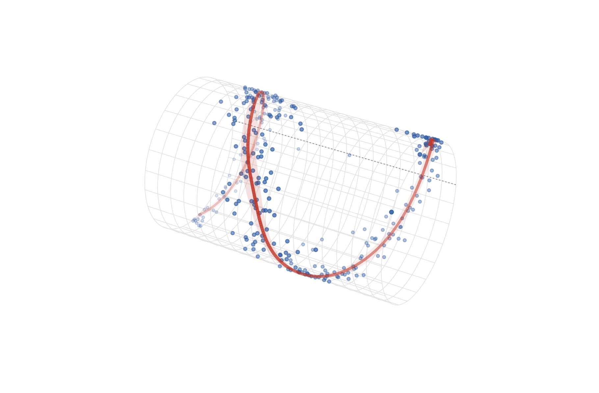

# Circular–linear regression on the cylinder

*One of three response–predictor geometries: **C–L** ·
[L–C](https://huangziwei.github.io/circlss/articles/linear-circular-regression.md)
·
[C–C](https://huangziwei.github.io/circlss/articles/circular-circular-regression.md).*

Circular–linear (C–L) regression is the core `circlss` case: a circular
response $`\theta`$ and ordinary covariates $`x \in \mathbb{R}`$,

``` math
\theta_i \sim \mathrm{vM}\big(\mu(x_i),\ \kappa(x_i)\big),
```

with both the mean direction and the concentration getting their own
linear predictor and smooths. The natural canvas is a **cylinder**: the
covariate runs along the axis, the response wraps around the
circumference, and the fitted mean direction is a curve on the surface.

Family guidance mirrors the [C–C
article](https://huangziwei.github.io/circlss/articles/circular-circular-regression.md):
**[`vmlss()`](https://huangziwei.github.io/circlss/reference/vmlss.md)**
leads — mean direction (tan-half link) and concentration (log link) are
separate, interpretable parameters — as long as the mean stays inside
one branch $`(-\pi, \pi)`$. When the phase *drifts* (the response keeps
rotating as $`x`$ grows, a helix on the cylinder), the tan-half map
cannot follow it across $`\pm\pi`$;
**[`pnlss()`](https://huangziwei.github.io/circlss/reference/pnlss.md)**
can.

## The distributional fit, with `vmlss`

A mean direction that swings around a reference as $`x`$ moves, and a
concentration that varies with it:

``` r

library(mgcv)
#> Loading required package: nlme
#> This is mgcv 1.9-4. For overview type '?mgcv'.
library(circlss)

rvm <- function(n, mu, kappa) {
  mu <- rep_len(mu, n); kappa <- rep_len(kappa, n); out <- numeric(n)
  for (i in seq_len(n)) {
    k <- kappa[i]
    a <- 1 + sqrt(1 + 4 * k * k); b <- (a - sqrt(2 * a)) / (2 * k)
    r <- (1 + b * b) / (2 * b)
    repeat {
      z <- cos(pi * runif(1)); f <- (1 + r * z) / (r + z)
      cc <- k * (r - f); u2 <- runif(1)
      if (cc * (2 - cc) - u2 > 0 || log(cc / u2) + 1 - cc >= 0) {
        out[i] <- sign(runif(1) - 0.5) * acos(max(min(f, 1), -1)) + mu[i]
        break
      }
    }
  }
  atan2(sin(out), cos(out))
}

set.seed(20260612)
n <- 250
x <- runif(n)
mu_true <- 2 * atan(1.6 * sin(2 * pi * x))
kappa_true <- exp(1.3 + 0.9 * cos(2 * pi * x))
dat <- data.frame(theta = rvm(n, mu_true, kappa_true), x = x)

b <- gam(list(theta ~ s(x), ~ s(x)),
         family = vmlss(), data = dat, method = "REML")
summary(b)
#> 
#> Family: vmlss 
#> Link function: tanhalf log 
#> 
#> Formula:
#> theta ~ s(x)
#> ~s(x)
#> 
#> Parametric coefficients:
#>               Estimate Std. Error z value Pr(>|z|)    
#> (Intercept)    0.02990    0.04863   0.615    0.539    
#> (Intercept).1  1.31958    0.08459  15.600   <2e-16 ***
#> ---
#> Signif. codes:  0 '***' 0.001 '**' 0.01 '*' 0.05 '.' 0.1 ' ' 1
#> 
#> Approximate significance of smooth terms:
#>          edf Ref.df Chi.sq p-value    
#> s(x)   7.110  8.085 780.44  <2e-16 ***
#> s.1(x) 4.608  5.631  79.98  <2e-16 ***
#> ---
#> Signif. codes:  0 '***' 0.001 '**' 0.01 '*' 0.05 '.' 0.1 ' ' 1
#> 
#> Deviance explained = 63.4%
#> -REML = 247.47  Scale est. = 1         n = 250
```

The two estimated smooths on the link scale — this per-parameter readout
(location *and* concentration, each with its own credible band) is the
distributional-regression payoff:

``` r

plot(b, pages = 1, scheme = 1)
```



## Flat view

The 95% band for $`\mu(x)`$ is the link-scale interval pushed through
the monotone tan-half link:

``` r

xg <- seq(0, 1, length.out = 400)
prl <- predict(b, newdata = data.frame(x = xg), type = "link",
               se.fit = TRUE)
mu_hat <- 2 * atan(prl$fit[, 1])
mu_lo <- 2 * atan(prl$fit[, 1] - 1.96 * prl$se.fit[, 1])
mu_hi <- 2 * atan(prl$fit[, 1] + 1.96 * prl$se.fit[, 1])

op <- par(mar = c(4, 4, 1, 1))
plot(dat$x, dat$theta, pch = 19, col = adjustcolor("#2c5aa0", 0.5),
     cex = 0.6, xlab = "x (linear covariate)",
     ylab = expression(theta ~ "(response angle)"),
     ylim = c(-pi, pi), axes = FALSE)
axis(1)
axis(2, at = c(-pi, -pi/2, 0, pi/2, pi),
     labels = expression(-pi, -pi/2, 0, pi/2, pi))
box()
polygon(c(xg, rev(xg)), c(mu_lo, rev(mu_hi)), border = NA,
        col = adjustcolor("#c0392b", 0.15))
lines(xg, 2 * atan(1.6 * sin(2 * pi * xg)), col = "gray60",
      lwd = 1.6, lty = 2)
lines(xg, mu_hat, col = "#c0392b", lwd = 2.6)
legend("topright", bty = "n", lwd = c(2.6, 1.6), lty = c(1, 2),
       col = c("#c0392b", "gray60"),
       legend = c(expression(hat(mu)(x) %+-% "95% band"), "truth"))
```



``` r

par(op)
```

Remember the vertical axis is a circle — the top and bottom edges are
the same line. The cylinder shows it without the cut.

## The cylinder

$`(x, \theta)`$ maps to $`\big(a(x),\ r\cos\theta,\ r\sin\theta\big)`$
with the covariate stretched along the axis. Same toolkit as the torus
article: [`persp()`](https://rdrr.io/r/graphics/persp.html) for the
projection matrix,
[`trans3d()`](https://rdrr.io/r/grDevices/trans3d.html) for drawing,
depth-based fading, and the 95% band as a translucent ribbon (the dashed
axial line is $`\theta = 0`$, the reference direction):

``` r

cyl_xyz <- function(x, theta, L = 1.7, r = 1.05) {
  list(x = L * (2 * x - 1),  # covariate [0, 1] -> [-L, L] along the axis
       y = r * cos(theta),
       z = r * sin(theta))
}

# view-space depth from the persp transformation matrix
depth3d <- function(x, y, z, pm) {
  p <- cbind(x, y, z, 1) %*% pm
  p[, 3] / p[, 4]
}

draw_cylinder <- function(dat, mu_hat, xg, lo = NULL, hi = NULL,
                          L = 1.7, r = 1.05,
                          theta_view = 30, phi_view = 28) {
  op <- par(mar = c(0.2, 0.2, 0.2, 0.2))
  on.exit(par(op))
  pm <- persp(x = c(-L - 0.15, L + 0.15), y = c(-r - 0.2, r + 0.2),
              z = matrix(c(-r, -r, r, r), 2, 2),
              zlim = c(-r - 0.4, r + 0.4),
              theta = theta_view, phi = phi_view, d = 4,
              scale = FALSE, expand = 1,
              col = NA, border = NA, box = FALSE, axes = FALSE)

  ## wireframe: rings at fixed x, axial lines at fixed theta
  thd <- seq(-pi, pi, length.out = 80)
  for (p in seq(0, 1, length.out = 18)) {
    w <- cyl_xyz(rep(p, length(thd)), thd, L, r)
    lines(trans3d(w$x, w$y, w$z, pm), col = "gray88", lwd = 0.6)
  }
  xd <- seq(0, 1, length.out = 120)
  for (t in seq(-pi, pi, length.out = 25)[-1]) {
    w <- cyl_xyz(xd, rep(t, length(xd)), L, r)
    lines(trans3d(w$x, w$y, w$z, pm), col = "gray88", lwd = 0.6)
  }

  ## theta = 0: the reference-direction line along the axis
  w <- cyl_xyz(xd, rep(0, length(xd)), L, r)
  lines(trans3d(w$x, w$y, w$z, pm), col = "gray55", lty = 3, lwd = 0.9)

  ## data on the surface, depth-faded
  w <- cyl_xyz(dat$x, dat$theta, L, r)
  dp <- depth3d(w$x, w$y, w$z, pm)
  a <- 0.15 + 0.7 * (dp - min(dp)) / diff(range(dp))
  pt <- trans3d(w$x, w$y, w$z, pm)
  ord <- order(dp)
  points(pt$x[ord], pt$y[ord], pch = 19,
         cex = 0.4 + 0.25 * a[ord],
         col = sapply(a[ord], function(ai) adjustcolor("#2c5aa0", ai)))

  ## 95% ribbon, depth-ordered translucent quads
  if (!is.null(lo) && !is.null(hi)) {
    K <- 4
    i0 <- seq_len(length(xg) - 1)
    quads <- list()
    for (k in seq_len(K)) {
      t0 <- lo + (hi - lo) * (k - 1) / K
      t1 <- lo + (hi - lo) * k / K
      for (i in i0) {
        th <- c(t0[i], t0[i + 1], t1[i + 1], t1[i])
        ph <- c(xg[i], xg[i + 1], xg[i + 1], xg[i])
        w <- cyl_xyz(ph, th, L, r)
        quads[[length(quads) + 1]] <-
          list(p = trans3d(w$x, w$y, w$z, pm),
               d = mean(depth3d(w$x, w$y, w$z, pm)))
      }
    }
    dq <- vapply(quads, `[[`, numeric(1), "d")
    aq <- 0.05 + 0.13 * (dq - min(dq)) / diff(range(dq))
    for (j in order(dq)) {
      polygon(quads[[j]]$p$x, quads[[j]]$p$y, border = NA,
              col = adjustcolor("#c0392b", aq[j]))
    }
  }

  ## fitted mean-direction curve, depth-painted
  w <- cyl_xyz(xg, mu_hat, L, r)
  dp <- depth3d(w$x, w$y, w$z, pm)
  cv <- trans3d(w$x, w$y, w$z, pm)
  a <- 0.25 + 0.75 * (dp - min(dp)) / diff(range(dp))
  seg <- data.frame(x0 = head(cv$x, -1), y0 = head(cv$y, -1),
                    x1 = tail(cv$x, -1), y1 = tail(cv$y, -1),
                    d = head(dp, -1), a = head(a, -1))
  seg <- seg[order(seg$d), ]
  segments(seg$x0, seg$y0, seg$x1, seg$y1,
           col = sapply(seg$a, function(ai) adjustcolor("#c0392b", ai)),
           lwd = 2.2 + 1.6 * seg$a, lend = 1)
  invisible(pm)
}
```

``` r

draw_cylinder(dat, mu_hat, xg, lo = mu_lo, hi = mu_hi)
```



The fitted mean direction swings around the reference line and back — it
never wraps the tube, which is exactly the class the tan-half link can
represent.

## Drifting phase: the helix, with `pnlss`

If the response keeps rotating as $`x`$ grows — a phase that advances,
$`\theta \approx \omega x`$ — the mean must cross $`\pm\pi`$ and wrap,
which `vmlss` cannot do on any branch. `pnlss` represents it with two
ordinary smooths, $`\mu_1(x)`$ and $`\mu_2(x)`$, whose angle winds
freely:

``` r

set.seed(20260612)
n <- 300
x2 <- runif(n)
dir_true <- 3 * pi * x2 - pi / 2 + 0.4 * sin(2 * pi * x2)  # 1.5 turns
gamma_true <- exp(0.7 + 0.3 * cos(2 * pi * x2))
theta2 <- atan2(gamma_true * sin(dir_true) + rnorm(n),
                gamma_true * cos(dir_true) + rnorm(n))
dat2 <- data.frame(theta = theta2, x = x2)

b2 <- gam(list(theta ~ s(x, k = 12), ~ s(x, k = 12)),
          family = pnlss(), data = dat2, method = "REML")

pr2 <- predict(b2, newdata = data.frame(x = xg), type = "response")
dir_hat <- atan2(pr2[, 2], pr2[, 1])

# delta-method band: joint Vp through atan2(mu2, mu1)
Xp <- predict(b2, newdata = data.frame(x = xg), type = "lpmatrix")
lpi <- attr(Xp, "lpi")
X1 <- Xp[, lpi[[1]], drop = FALSE]
X2 <- Xp[, lpi[[2]], drop = FALSE]
V <- b2$Vp
v11 <- rowSums((X1 %*% V[lpi[[1]], lpi[[1]]]) * X1)
v22 <- rowSums((X2 %*% V[lpi[[2]], lpi[[2]]]) * X2)
v12 <- rowSums((X1 %*% V[lpi[[1]], lpi[[2]]]) * X2)
m1 <- pr2[, 1]; m2 <- pr2[, 2]; r2 <- m1^2 + m2^2
se_dir <- sqrt(pmax(m2^2 * v11 + m1^2 * v22 - 2 * m1 * m2 * v12, 0)) / r2

draw_cylinder(dat2, dir_hat, xg, phi_view = 32,
              lo = dir_hat - 1.96 * se_dir, hi = dir_hat + 1.96 * se_dir)
```



A helix: the fitted direction wraps the cylinder one and a half times
between $`x = 0`$ and $`x = 1`$, delta-method ribbon along for the ride.
The same trade as on the torus applies — `pnlss` buys unbounded rotation
at the price of entangling direction and concentration in
$`(\mu_1, \mu_2)`$.

## Same models, same numbers, in Python

Both fits are the mgcv twins of
[pycircstat2](https://github.com/circstat/pycircstat2)’s
`CLRegression(..., family=vmlss | pnlss)` and are differentially tested
against it on every release — identical data, Newton-REML both sides
(see `tests/testthat/test-*-parity.R` and `dev/parity/` in the
repository).
